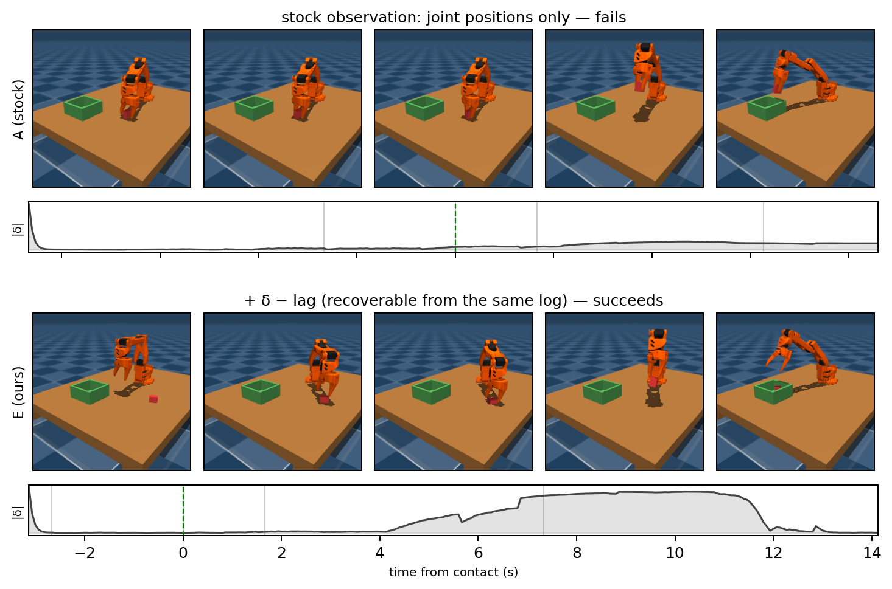
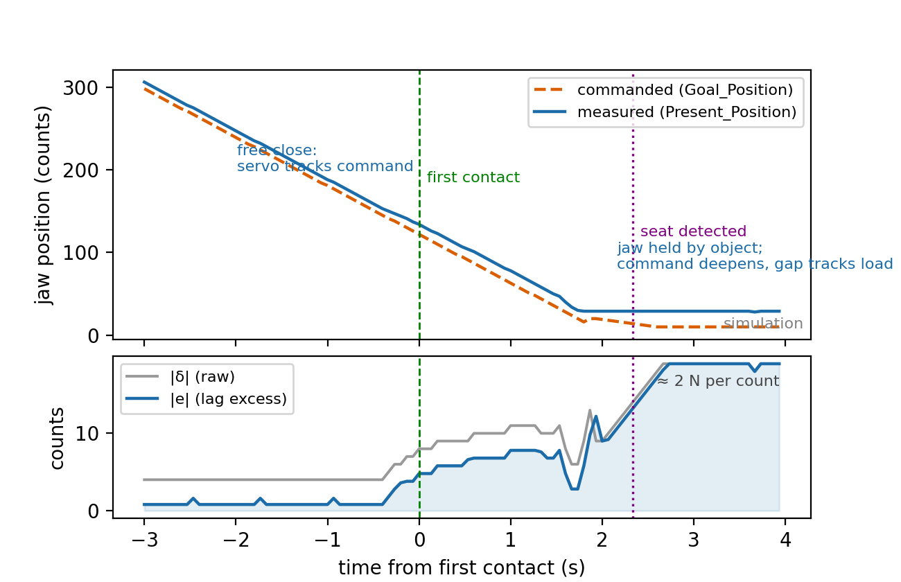
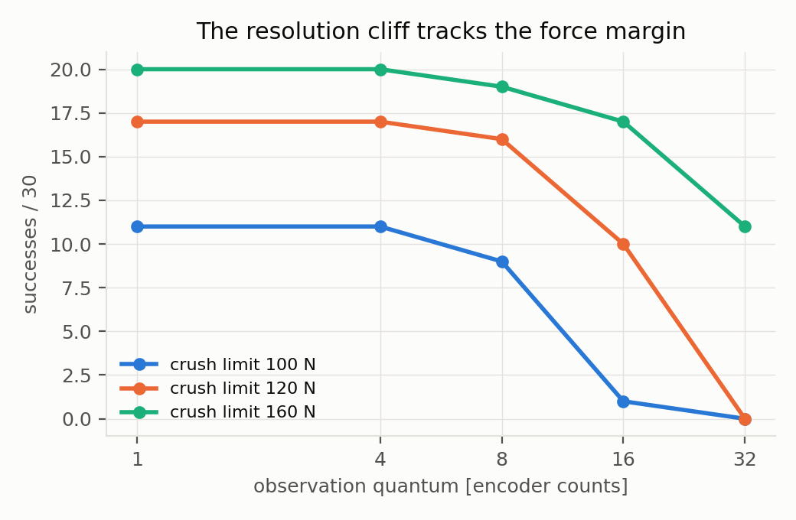
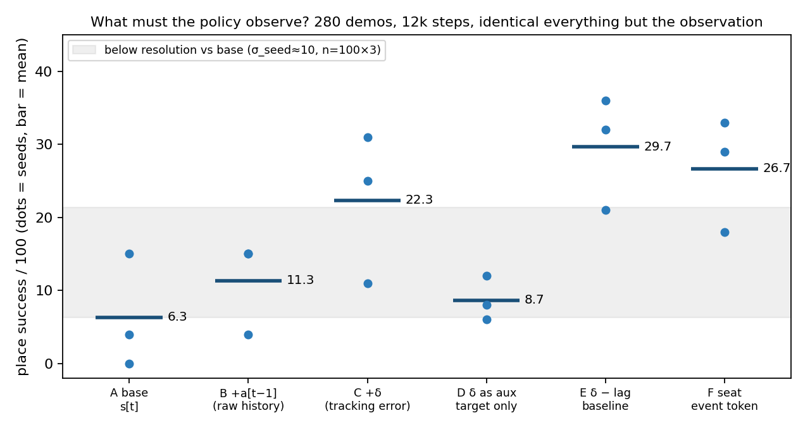
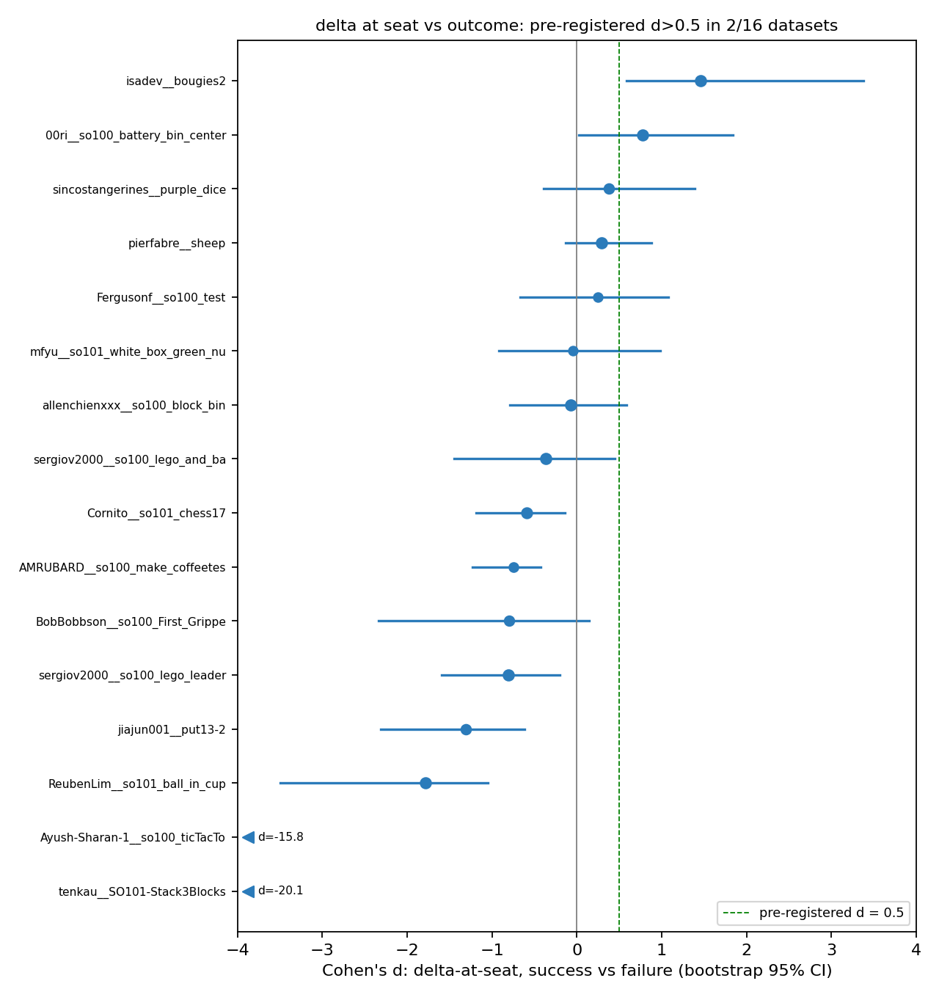

# The Observation the Fleet Already Logs: Tracking Error as a Force Channel at Small Data

*Luai Abuelsamen — draft v0.3, 2026-08-18. Workshop-sized: four pages,
three figures plus one hardware figure pending. Status: main grid final
(5 seeds); guarded column and bench calibration in progress; full lab
record with every n and CI in [findings.md](findings.md).*

---

## Abstract

Low-cost servo arms ship without force sensing, and the behavior-cloned
policies people train on them grasp blindly. But the ecosystem's own logs
already contain a force observation: the tracking error
`δ = action[t−1] − state[t]`, the servo loop's rejection of its command.
ACT's authors name this quantity themselves — force "is implicitly defined
by the difference between" leader and follower positions — and then ship a
policy that observes only one of its operands; stock LeRobot reads
`Present_Position` alone. We characterize the channel and its validity
envelope in simulation, then ask the question the small-data regime forces:
**what must the policy observe?** Across six observation designs at 280
demonstrations (5 seeds × 100 episodes each), predicting the channel as an
auxiliary target contributes nothing (6.6 vs 6.2/100 for the channel-free
base, t=0.1), while observing it — in a form that subtracts the servo's
free-motion lag — is the only design that resolvably beats raw action
history (26.6 vs 13.8, t=2.6). A pre-registered study across 16 public
teleoperation datasets falsifies the naive ecosystem-scale hope in an
informative direction: in the wild, high δ at grasp time predicts
*struggle*, not success. The channel is real, recoverable retroactively
from every position-only log the fleet has ever recorded, and useful — but
only if the policy actually sees it, and only in the right form.

---

*Fig. 1 — identical scene, identical data budget, two observers. Top: the
stock observation (joint positions only) reaches, grips, and abandons the
block. Bottom: the same network plus the δ−lag channel — recoverable from
the same log — places it. The |δ| traces under each row show what the
stock policy never sees.*

---

## 1. The channel and its envelope

The STS3215-class servo tracks integer `Goal_Position` commands with a
proportional loop. When the jaw meets an object, the measured position
stalls while the command deepens, and the gap is a force reading: on our
simulated plant, **2.00 N per encoder count**, linear while seated and
quasi-static (held-out RMSE 4.3 N over 4–78 N), non-informative while the
jaw slides freely, and meaningless during fast transport. The channel's
resolution requirement tracks the physical safety margin — coarsening the
observation collapses force-aware grasping as a cliff whose location moves
with the margin:

*Fig. 2 — the mechanism on one servo, one grasp: the measured position
tracks the command through the free close (small lag), then the object
holds the jaw while the command deepens — the gap is the force reading,
≈2 N per count, with first contact and the detector's seat event marked.*

*Fig. 3 — the resolution requirement is a design rule
(`quantum < margin / N-per-count`), not a benchmark number.*

Neighbours, conceded up front: NeuralActuator (RSS 2026) demonstrates
force-aware BC beating position-only control on this servo class, using
live load-register telemetry and an instrumented calibration rig; FACTR 2
feeds estimated external torque into BC via current telemetry. Neither
channel exists in recorded public data. The strip claimed here is exactly
what they leave open: **no currents, no calibration hardware, recoverable
retroactively** from the position-and-command logs every LeRobot-compatible
rig already writes.

## 2. What must the policy observe? (central result)

Six observation designs, identical in every other respect — 280
demonstrations, 12k training steps, 96 px, ACT, 5 seeds × 100 evaluation
episodes per cell. Seed variance was measured first (σ_seed ≈ 10 points at
n=100), and no gap below the corresponding resolution is claimed.

*Fig. 4 — dots are seeds, bars are means; the gray band is the
below-resolution zone against base.*

| arm | observation | mean/100 | vs base | vs raw history |
|---|---|---|---|---|
| A base | s[t] | 6.2 | — | — |
| B history | s + a[t−1] | 13.8 | +7.6 (ns) | — |
| C delta | s + δ | 21.8 | **+15.6** (t=3.1) | +8.0 (ns) |
| D aux-target | s only; δ predicted | 6.6 | +0.4 (t=0.1) | −7.2 (ns) |
| E lag-subtracted | s + (δ − K̂·rate) | **26.6** | **+20.4** (t=4.7) | **+12.8** (t=2.6) |
| F seat token | s + latched seat bit | 21.8 | **+15.6** (t=3.1) | +8.0 (ns) |

Three sentences survive at resolution. **(i) The channel must be observed,
not predicted:** arm D trains the identical encoder to *predict* δ as an
auxiliary target and lands dead-equal to the channel-free base — the
information as training signal contributes nothing, the same information as
input triples success. **(ii) Only the designed form resolvably beats raw
action history:** E subtracts the servo's free-motion following lag
(K̂ fit per joint by least squares on the jaw-open frames of the same
training set — label-free, frozen before training), separating load from
motion; raw δ's +8.0 over history does not resolve. **(iii) Channel-bearing
observation beats channel-free** across every input form (t = 3.1–4.7).
Pre-registration disciplined this table twice: F's three-seed margin was
flagged as at-the-floor and collapsed under seeds 4–5; E's was flagged
resolved and held.

## 3. The ecosystem study: an informative negative

If δ is recoverable from every public dataset, does it predict grasp
outcomes ecosystem-wide? Pre-registered protocol (frozen before the run):
seat detection by the stall detector, δ-at-seat as unsigned tracking error,
success proxy = gripper stays closed and the arm transports; prediction:
successes carry higher δ, Cohen's d > 0.5 in ≥ half of 20 datasets.

*Fig. 5 — per-dataset Cohen's d, bootstrap 95% CI; 16 datasets scored of
the 20 targeted (candidate pool + frozen gates + connectivity, documented).*

**The prediction is falsified: 2/16.** But 9/16 datasets show |d| > 0.5,
six of them significantly *inverted*. The traces explain the physics:
teleop leaders have no hard stop, so operators over-command every close and
empty jaws stall at the mechanical limit exactly like full ones; successful
grasps are stereotyped low-δ closes (in one dataset, every clean episode
rests at the same 7-count gap — the channel reading the same grasp
identically), while failures carry 40–80-count frames of an operator
forcing a jammed grasp. **In the wild, δ at grasp time is a struggle
signal, not a success signal.** The strongest retroactivity claim dies by
its own test; what survives is a channel that is recoverable, informative,
and task-dependent in sign — an anomaly and safety signal rather than a
free label mine.

## 4. Infrastructure

A ~40-line jaw guard — net-travel stall and lag-excess seat detection, a
force-budget cap (+24 N past seat), a closing-rate limit — runs from bus
telemetry alone and passes the paired-reference test: the scripted teacher
places 25/30 through it versus 28/30 raw (grip 39 N), and it converts a
crush-heavy learned policy from 27 to 3 crush events at the 60 N tier.
This is engineered plumbing in the industrial-gripper tradition, reported
as infrastructure with its integration lessons — the policy must observe
*applied* commands, not intentions, and any controller wrapped by a rate
limiter must be closed-loop on contact — rather than as a contribution.
Training through the guard (demonstrations collected with the cap active)
is cost-neutral within resolution across the arms measured so far.

## 5. Hardware calibration

[PENDING — the one figure that touches reality: δ vs `Present_Load` vs
`Present_Current` vs a load cell on a physical STS3215, staircase protocol
at three speeds. Comparison rows: the simulator's 2.0 N/count, Hwang 2018,
NeuralActuator's reported error. Every Newton above inherits the
simulator's contact model until this lands; a negative transfer would
itself be the first honest measurement of the channel on hardware.]

## 6. Method notes carried

σ_seed measured before any comparison (and retroactively downgrading every
two-seed claim this project once made); a working reference paired with
every null before it earned a sentence; an oracle-first admission test for
benchmarks (a rigid-block control shows standard pick-place cannot detect
force sensing at all); deleted-success accounting for safety wrappers.
Offered as a checklist, not a framework.

## Limitations

One gripper, one object family, simulation except §5. Five seeds at n=100
resolves ~11-point gaps and nothing finer; C−B (+8.0) and E−C (+4.8)
remain honestly open. The corpus success proxy is unvalidated against
ground truth (none exists in the data). The guarded-column and hardware
results are in progress at this draft.

## The wall this paper found

What must a policy observe to grasp reliably at 200 demonstrations on a
$500 arm? Position-only observation is not enough; one channel the fleet
already logs, in the right form, moves the floor. The next paper attacks
the question directly.
